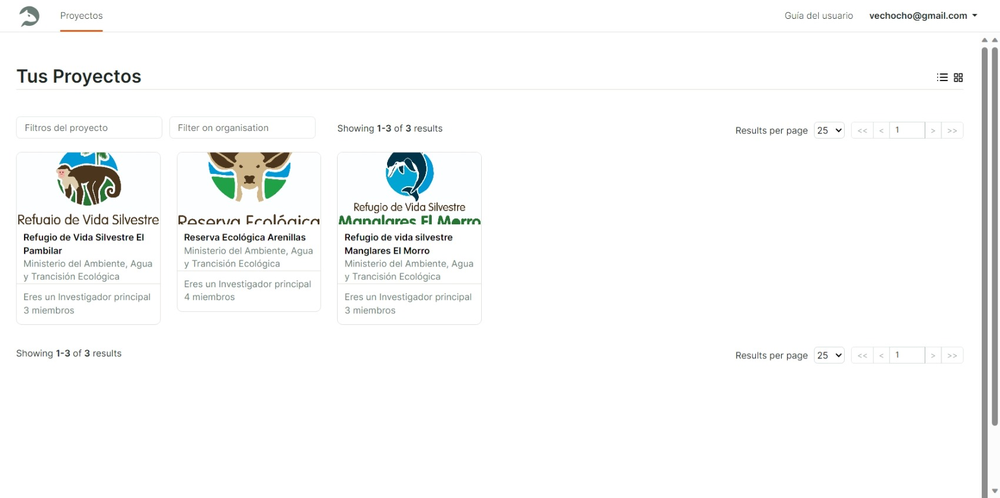
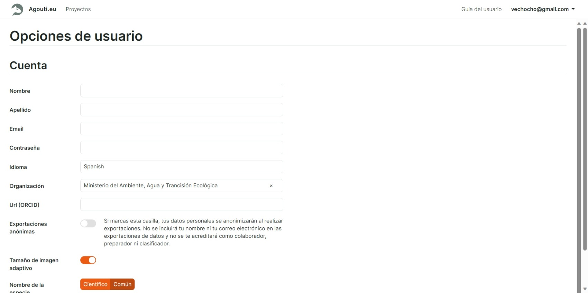

== Usando Agouti
=== Panel de control

Tu panel personal muestra todos los proyectos a los que tienes acceso. Haga clic en un mosaico para entrar en un proyecto.

Si ha solicitado acceso a un proyecto pero éste aún no ha sido aprobado, se mostrará el estado "en espera de acceso" y no podrá entrar. Póngase en contacto con el coordinador del proyecto en caso de que su acceso no haya sido aprobado después de algún tiempo.

[#img-corrected-center]

=== Opciones de ususario

Aquí puede cambiar los detalles de su cuenta, contraseña, organización, idioma de la interfaz y varios ajustes de la interfaz.

*Exportaciones anónimas*: si activa esta opción, su nombre y correo electrónico no se incluirán en los datos exportados del proyecto. En su lugar, se genera un identificador único que no puede ser rastreado hasta usted. Como resultado, no se le acreditará como colaborador, persona de configuración y/o clasificador en ningún dato exportado.

*Tamaño de imagen adaptativo*: esta configuración controla si las imágenes se redimensionan y comprimen antes de ser enviadas a su navegador durante la anotación. Esto ahorra ancho de banda a costa de un pequeño aumento del tiempo de carga. Para conexiones rápidas y sin contador, recomendamos desactivar esta opción. Si tiene una conexión lenta, inestable o con contador, active esta opción. Por defecto, está activada.

*Nombre de la especie*: controla si los nombres de las especies se muestran en notación común o científica durante la anotación. Si no se dispone del nombre común de una especie, se mostrará en su lugar el nombre científico y se imprimirá en cursiva.

*Anotar atajos*: controla la cantidad de atajos que se muestran durante la anotación. Se construye dinámicamente en función de la última especie introducida. Establezca este valor en 0 para desactivar los accesos directos. Ajuste por defecto: 5.

[#img-corrected-center]

=== Vista general / Resumen

Muestra un breve resumen de tu proyecto, incluyendo un mapa con los despliegues. Trabajo en curso y se ampliará con una información más útil, dependiendo de su papel en el proyecto.

=== Importar

Para cargar un nuevo despliegue en su proyecto, siga estos pasos:

* Haga clic en el botón *_Añadir despliegue_*. Se abrirá un formulario.
* llene los datos del formulario relacionados a su despliegue 
** *Localización*: Elija la localidad del despliegue, corresponde a la ubicación (latitud y longitud) en la que estuvo la cámara durante un timpo determinado.
** *Desplazamiento UTC*: seleccionar -05:00UTC si no esta seleccionado automáticamente.
** *inicio y final*: esta sección no es necesario llenarla, la información serán extraidos de los metadatos de las fotos cargadas 
* de clic en *_Añadir despliegues_*

Usando arrastrar y soltar, arrastra todos los archivos de tu carpeta local al modal. Cuando aparezca el texto "drop to upload", suéltalo. Los archivos comenzarán a cargarse. Dependiendo de la velocidad de tu conexión y de la carga del servidor, esto puede tardar un poco.

Alternativamente, utilice el botón de selección de archivos para abrir un diálogo tradicional de selección de archivos. Este cuadro de diálogo es limitado y sólo le permite seleccionar una cantidad limitada de archivos. Le recomendamos que utilice la función de arrastrar y soltar.

Si lo desea, puede cargar sus archivos por lotes. Sólo tiene que añadir más archivos cuando se complete la cola y se añadirán al mismo despliegue. Los duplicados se omiten automáticamente.

[WARNING]
=====
Nunca mezcles archivos de diferentes despliegues. Sube siempre todos los archivos de una misma cámara, desde la primera hasta la última. Por tanto, todos los archivos, desde que se enciende la cámara hasta que se apaga de nuevo.
=====

Si la cámara creó varias subcarpetas o se reinició contando en algún momento, suba estas carpetas como despliegues separados. Alternativamente, utilice una herramienta o script para continuar la numeración.

No hay límite en la cantidad de archivos que puede subir por despliegue, pero puede que quiera dividir los despliegues grandes en partes que no consten de más de 10.000 archivos. Serán adyacentes en el tiempo, por lo que es bastante fácil fusionarlos durante el análisis.

Una vez que la cola haya terminado de cargarse, cierre el modal. Aparecerá un botón llamado crear secuencia. Haga clic en él y confirme la pro