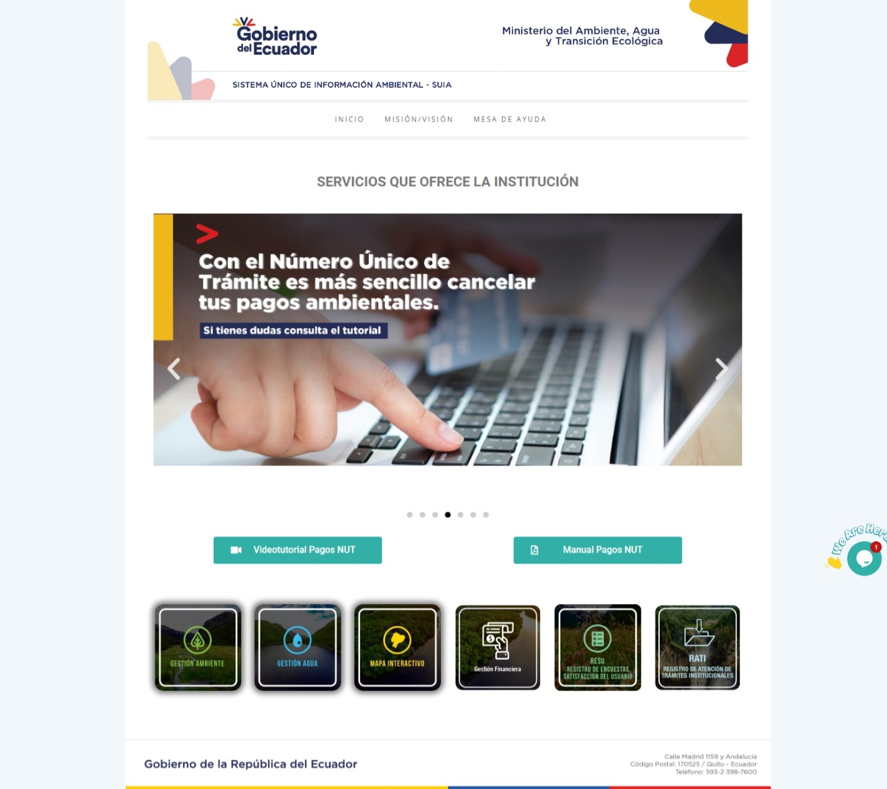
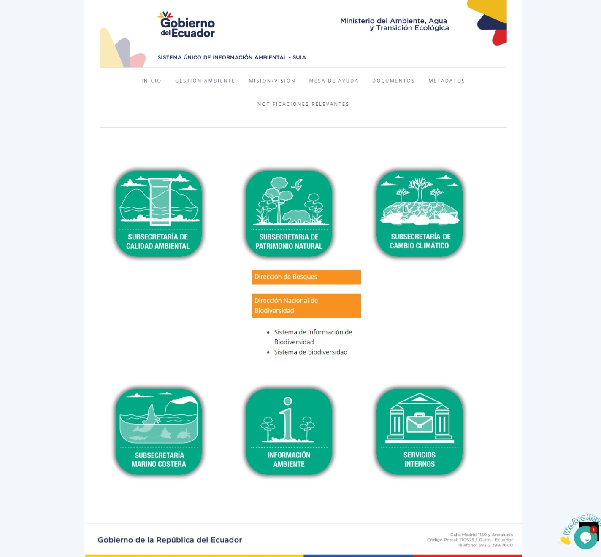

[[short-id-for-section]]
== Introducción

El presente documento tiene como objeto proporcionar la información necesaria para la operación del Sistema de Biodiversidad en su módulo de “Autorización de recolección de especímenes de especies de la diversidad biológica sin fines comerciales”, con la finalidad de apoyar la gestión de trámites y procesos encaminados al uso, seguimiento y conservación de la biodiversidad a nivel nacional y al servicio de toda la ciudadanía. 

== Ingreso al Sistema

Para el ingreso al Sistema de Biodiversidad en el módulo de “Autorización de Recolección de Especies sin fines Comerciales”, diríjase a la página web del http://suia.ambiente.gob.ec[Sistema Único de Información Ambiental] donde deberá seleccionar la opción Gestión Ambiente (Ver Figura 1).

[#img-corrected-center]

Luego se deberá seleccionar dentro de la sección correspondiente a la Subsecretaría de Patrimonio Natural la opción "Sistema de Biodiversidad" que se ecnuentra en la "Dirección de Biodiversidad" (Ver figura 2).

Se presentará la pantalla de la Figura 3 en la cual deberá, como primer paso, registrar su usuario para obtener las credenciales para el ingreso al Sistema para obtener la Autorización de Recolección de Especies sin fines Comerciales (Ver Figura 3).

. prueba footnote:[The double hail-and-rainbow level makes my toes tingle.]  
. tertiary footnote:[Nota al pie]
. 